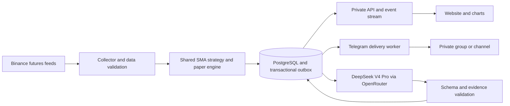

> Superseded on 3 October 2026 by the EMA20 + EMA50 + SMA200 + ATR plan. Preserved for historical comparison only.

# MV Signal — research and development plan

Research date: 3 October 2026, Asia/Kolkata.

Confirmed scope: Binance futures long/short signals for a personal/private group, delivered on a private website and Telegram. Proposed defaults: USDT-margined perpetual contracts, BTCUSDT and ETHUSDT first, 1-hour signal candles, and 4-hour trend confirmation. The user selected Binance but has not explicitly confirmed the timeframes, symbols, hosting budget, or exit policy.

This is an implementation and validation plan. No historical strategy test, authenticated AI inference, profitability assessment, bot registration, deployment, or real-money trade has been performed. The proposed trading rules are hypotheses to test, not established profitable rules. A defect-free application cannot be guaranteed; reproducible calculations, strict validation, recovery, monitoring, and release gates are the practical objective.

## 1. Recommended product and division of responsibility

Build a private, continuously running market monitor with one deterministic SMA strategy, AI explanations, a paper-trade ledger, and durable alert delivery.

The service monitors the exchange 24/7. DeepSeek receives fresh, timestamped snapshots when a relevant event occurs; an API model does not keep watching the market between requests by itself. Software must supply data and schedule requests.

Separate responsibilities:

| Component | Owns | Must not own |
| --- | --- | --- |
| Market collector | Futures candles, contract quotes, mark price, funding snapshots, freshness | Directional predictions |
| Strategy engine | SMA 50/100/200, entry triggers, deterministic exits, rule evidence | Unversioned discretionary changes |
| Risk/paper engine | Entry assumptions, frozen stop/target, paper fills and accounting | Claims about actual user fills |
| DeepSeek V4 Pro | Explain checked evidence; flag inconsistencies for inspection; summarize SMA regimes | Authoritative SMA arithmetic, invented prices, automatic strategy edits |
| Delivery worker | Persisted alerts, retry scheduling, Telegram status | Generating a second version of the signal |
| Website | Shared signal records, charts, history, status, administration | Private API keys or browser-side signal decisions |

This structure preserves an SMA-only strategy. If AI can select different entries or veto valid signals for discretionary reasons, that becomes a separate AI strategy and requires its own evaluation. Start that approach in shadow mode if desired. Model benchmark scores do not establish a trading edge.

## 2. Verified research findings

### DeepSeek and OpenRouter

The catalog lists `deepseek/deepseek-v4-pro-0813` as the GA V4 Pro model. The similarly named `deepseek/deepseek-v4-pro` entry refers to the older 0423 release. Pin the 0813 ID rather than a rolling latest alias. [OpenRouter models API](https://openrouter.ai/api/v1/models).

The public provider catalog returned 20 endpoints during research. Feature support and pricing vary across providers; test the selected route with a real request before launch. [V4 Pro provider catalog](https://openrouter.ai/api/v1/models/deepseek/deepseek-v4-pro-0813/endpoints).

The model page currently displays $0.22 per million input tokens and $4.20 per million output tokens for one available pricing combination, with other provider combinations listed. These are a dated cost reference, not a fixed rate for every route. [V4 Pro model page](https://openrouter.ai/deepseek/deepseek-v4-pro-0813).

OpenRouter documents JSON-schema responses and `provider.require_parameters: true`; validate responses locally even with schema enforcement. [Structured outputs](https://openrouter.ai/docs/guides/features/structured-outputs). Provider routing supports price ceilings and provider selection. [Provider routing](https://openrouter.ai/docs/guides/routing/provider-selection). Reasoning tokens consume output budget and remain billable when excluded from returned text. [Reasoning tokens](https://openrouter.ai/docs/guides/best-practices/reasoning-tokens).

### Binance futures

Current documentation routes futures candles and mark-price streams through `wss://fstream.binance.com/market`, while book tickers use `/public`. Older unrouted examples can miss market messages. Use the current mapping and verify actual payloads. [WebSocket migration notice](https://developers.binance.com/en/docs/products/derivatives-trading-usds-futures/websocket-market-streams/Important-WebSocket-Change-Notice).

Binance documents 24-hour WebSocket connections and ping/pong requirements. Planned rotation, reconnect, and reconciliation are required. [Futures connection documentation](https://developers.binance.com/en/docs/products/derivatives-trading-usds-futures/websocket-market-streams/Connect).

The futures REST catalog provides `/fapi/v1/klines`, `/fapi/v1/exchangeInfo`, `/fapi/v1/premiumIndex`, `/fapi/v1/fundingRate`, `/fapi/v1/fundingInfo`, and `/fapi/v1/markPriceKlines`. It exposes symbol filters and adjusted funding intervals. Read actual contract metadata and funding timestamps rather than assuming identical precision or funding schedules. [USDⓈ-M market data](https://developers.binance.com/en/docs/catalog/core-trading-derivatives-trading-usd-s-m-futures/api/rest-api/market-data).

Binance publishes daily/monthly futures history and checksum files; archives may receive corrections. Snapshot downloaded datasets and record checksums. [Official public-data repository](https://github.com/binance/binance-public-data).

### Telegram

BotFather creates the bot and provides its token; our backend implements its behavior. Users must initiate a private bot conversation before receiving direct messages. [Bot introduction](https://core.telegram.org/bots).

Telegram documents approximate default broadcast limits of 30 messages/second, about one message/second per chat, and 20 messages/minute in a group. Design a per-destination queue. [Bots FAQ](https://core.telegram.org/bots/faq).

The Bot API supports a webhook secret header and provides `retry_after` for flood-control responses. [Telegram Bot API](https://core.telegram.org/bots/api).

### Strategy evidence

SMA is an arithmetic average of prices across a specified number of bars; longer windows add smoothing and lag. Periods mean candles on the selected timeframe, not automatically days. [Fidelity SMA guide](https://www.fidelity.com/learning-center/trading-investing/technical-analysis/technical-indicator-guide/sma).

Research on backtest overfitting shows why selecting a winner from many configurations can produce misleading performance. Keep a trial log and evaluate chronological forward periods; a single attractive historical chart is insufficient. [Bailey et al., The Probability of Backtest Overfitting](https://www.davidhbailey.com/dhbpapers/backtest-prob.pdf).

### Feasibility checks performed

Two unauthenticated requests from the current development computer succeeded: Binance futures server time and the OpenRouter V4 Pro provider catalog. This verifies basic connectivity from this computer only. Production-region connectivity, the exact WebSocket payloads, provider schema behavior, and account-funded inference remain launch checks.

Some older Binance stream-specific documentation URLs redirected to the documentation homepage during research. Use the current official route notice, REST catalog, and live contract fixtures; do not treat a successful HTTP response from a redirected documentation page as proof that a stream integration works.

## 3. Initial scope

Included:

- Binance USDT-margined perpetual crypto contracts, starting with BTCUSDT and ETHUSDT.
- Long and short setup alerts using only price relationships to SMA 50, 100, and 200.
- Closed 1h entries and closed 4h confirmation, proposed defaults.
- Private responsive website, invite-only access, and admin role.
- Private Telegram group or channel, plus optional linked direct messages.
- Signal history, rule evidence, immutable versions, delivery records, and paper performance.
- Continuous monitoring of paper stop/target crossings and hourly trend exits.
- Admin pause for new entries, independent health monitoring, and backups.

Deferred:

- Automatic order placement, exchange account integration, and trade-enabled Binance keys.
- Payment processing and public subscriptions.
- Many exchanges, hundreds of contracts, discretionary news analysis, and extra indicators.
- Personalized leverage recommendations or purported profit probabilities.

Signal-only scope requires market data, an OpenRouter key, and a Telegram bot token. Users place and manage their own exchange orders. A website alert or a Telegram message does not place a protective stop on Binance.

## 4. Strategy contract: SMA-PULLBACK-v1

The strategy below is the recommended research baseline. Freeze it before the first backtest. Other alternatives belong to separate versions.

### Definitions

Use ordinary futures contract-trade candle closes from the selected symbol. Keep mark-price data in a separate series.

For a closed candle t:

`SMA_n(t) = sum(close[t-n+1 : t+1]) / n`, for n in {50, 100, 200}.

Use exact decimal input and calculations at a documented precision; do not round averages before comparisons. Display rounding is separate. Equality does not satisfy a strict bullish/bearish ordering.

1h bullish regime: `SMA50(t) > SMA100(t) > SMA200(t)`.

1h bearish regime: `SMA50(t) < SMA100(t) < SMA200(t)`.

All other states: mixed. Display the reason and produce no new entry.

For 4h confirmation, use the most recent complete, validated 4h candle whose end boundary is no later than the 1h decision boundary. At a shared 1h/4h close, wait for the expected 4h candle to finalize; do not silently substitute the preceding 4h candle because it arrived first. In historical replay, reproduce the specified arrival/settling delay.

### Long setup

All conditions must hold:

1. Current 1h regime is bullish.
2. Latest eligible closed 4h regime is bullish, and its close is above its SMA50.
3. Previous 1h close was at or below its contemporaneous SMA50: `C(t-1) <= SMA50(t-1)`.
4. Current closed 1h candle reclaims SMA50: `C(t) > SMA50(t)`.
5. Data is contiguous, sufficiently warmed, fresh, and validated.
6. No active paper position or active entry setup exists for this symbol and strategy.

This is a close-to-close reclaim, not an intrabar low touching the SMA.

### Short setup

Mirror the long rules:

1. Current 1h regime is bearish.
2. Closed 4h regime is bearish, and its close is below its SMA50.
3. `C(t-1) >= SMA50(t-1)`.
4. `C(t) < SMA50(t)`.
5. The same data-quality and state conditions pass.

### Why this baseline

SMA ordering defines direction; a price reclaim/loss defines a new event and gives an explicit entry trigger. Trend ordering alone describes an ongoing state and would otherwise generate repeated alerts. A 4h filter is a research hypothesis that may reduce activity and enter later; test it rather than claiming it improves results.

### Warm-up and exclusions

- A current SMA200 requires 200 completed contiguous candles. A previous complete indicator state requires at least 201. Load 500 completed candles on each timeframe to simplify restart and history checks; 500 is an operational buffer, not a special mathematical requirement.
- SMA200 on 1h covers 200 hours; on 4h it covers 800 hours, about 33.3 days.
- Do not create retroactive entries simply because the app starts in a bullish/bearish regime.
- One position per symbol and strategy; no pyramiding and no same-candle reversal.
- After an exit, require a new reclaim/loss event on a later closed candle. There is no arbitrary time cooldown in the baseline.
- Do not add RSI, MACD, ATR, volume direction, sentiment, SMA slope, or SMA separation filters to this baseline. Record any proposed alternative in the experiment log.

## 5. Entry, stop, target, and exit policy

SMA direction rules alone do not define a complete futures signal. Entry assumptions and exit rules must be explicit for honest accounting.

### Publication and entry reference

After the closed-candle decision, fetch or read a fresh best bid/ask from the correct futures contract feed. For a long, the entry reference E is the ask; for a short, E is the bid. Record both the signal candle close and this later quote with separate timestamps.

Proposed entry validity: 5 minutes after the source candle boundary, subject to freshness and continuing validity. Treat this as a configurable product policy to test, not an optimized strategy parameter. Do not publish a new entry after that window during outage recovery. Store the missed event for audit.

Proposed quote-freshness limit: 5 seconds. If stale, request a fresh quote or block publication. Reject entry if price has already crossed the proposed stop or if the setup has otherwise become invalid. Keep the published plan immutable; do not repeatedly rewrite its entry to track price.

The user may enter at a different price or later time. The UI must distinguish an indicative plan, the system's paper fill, and a user-reported trade.

### Risk policy RISK-SMA100-2R-v1

- Freeze the initial protective stop S at the signal candle's 1h SMA100, rounded conservatively to contract tick size: down for a long stop, up for a short stop.
- Long requires S < E. Define R = E - S and TP = E + 2R.
- Short requires S > E. Define R = S - E and TP = E - 2R.
- Use one full-position target for the baseline; no partial targets, trailing stop, or automatic breakeven move.
- Round the target to a valid tick without increasing the claimed reward: down for a long target, up for a short target. Recalculate the displayed ratio after rounding.
- Fixed stop and target crossings use contract-trade price for paper monitoring. Annotate this trigger basis prominently. Mark-price data is shown separately for futures context.
- Trend exit: on a completed 1h candle, exit a paper long if close <= current SMA100; exit a paper short if close >= current SMA100. Execute the paper exit at the next available modeled price after the decision, not retrospectively at the candle close.
- Whichever applicable exit occurs first wins. If event ordering cannot be recovered, label it uncertain and apply conservative reporting.

The 2R target is a risk-policy convention, not another indicator and not evidence of a 2R realized return. A stop can fill worse than its trigger, and fees/funding reduce net results. Compare a separately versioned SMA exit policy without a fixed target during research.

### Sizing and leverage

Offer a paper risk calculator using user-entered equity and loss budget. For a linear USDT contract, approximate quantity before costs is `loss_budget_USDT / abs(E - S)` in base-asset units. Include estimated entry/exit fees and adverse fill allowance when deriving practical quantity, then round quantity down to the symbol step size and validate minimum notional.

Do not let DeepSeek choose account-specific leverage. Exact liquidation depends on account mode, collateral, maintenance requirements, size, and other positions. The signal app has none of that account state in v1. Report price-distance risk and unlevered/notional performance; do not label either as account return on margin. Any future leverage simulation must specify these additional assumptions.

Funding may debit or credit a held position. Use the actual funding events and mark-price notional at those timestamps in the simulation. Funding is a cost/context field, not a directional filter in this SMA-only baseline.

## 6. Market-data collection and recovery

### Initial feeds

Market route examples:

```text
wss://fstream.binance.com/market/stream?streams=btcusdt@kline_1h/btcusdt@kline_4h/btcusdt@markPrice@1s/btcusdt@aggTrade
```

Add equivalent ETH streams. The best-bid/ask stream belongs on the public route:

```text
wss://fstream.binance.com/public/stream?streams=btcusdt@bookTicker/ethusdt@bookTicker
```

These examples follow the researched routing notice; validate exact subscriptions and payload schemas in an integration spike before treating them as production-ready configuration.

Closed-candle handling must validate the futures payload close flag, conventionally `k.x == true`, alongside symbol, interval, start/end boundaries, and timestamps. Capture an actual closed futures payload as a fixture. Open candles may animate charts, but never drive confirmed strategy entries.

Use UTC boundaries internally. Convert timestamps to Asia/Kolkata only for presentation. Use an exclusive candle end boundary internally even when the exchange reports an inclusive last millisecond.

### Processing order

1. Normalize and validate an incoming event.
2. Store finalized candles keyed by venue, product, symbol, interval, and open time.
3. Check sequence continuity and warm-up.
4. Wait for required cross-timeframe finalization.
5. Compute the indicator snapshot and rule evidence using the shared strategy package.
6. Under a database transaction and a symbol/strategy lock, store the evaluated decision, resulting paper state transition, signal, and outbox jobs.
7. Publish website events only after commit; run AI and Telegram jobs independently.

Avoid saving every transient price update to PostgreSQL. Keep latest quotes in bounded memory, persist decision snapshots, finalized small candles, and paper position events. Retain granular historical execution data as compressed files for research.

### Reconnect and reconciliation

- Keep heartbeats, last event time, last finalized candle, and processing watermarks per feed.
- Rotate the WebSocket before its documented connection lifetime; overlap feeds briefly and deduplicate.
- Reconnect with exponential backoff and jitter.
- On restart, open and buffer the stream, backfill the REST gap through the latest completed candle, merge/deduplicate buffered events, and resume ordered processing.
- Respect REST weight limits and response headers; honor retry guidance and IP-ban responses.
- Do not forward-fill missing candle prices to fabricate history.
- If a data gap cannot be resolved, pause new entries for that symbol and surface the gap.
- If paper positions were open during the gap, reconcile granular prices where possible. If stop/target order remains unknowable, mark the outcome as uncertain rather than assigning a profitable fill.
- Recover the strategy state from persisted events. Backfill may update history, but must not send old entry alerts as current opportunities.
- If a finalized candle is later corrected, version the candle and append an explicit correction record. Preserve the original signal evidence and original backtest dataset.

## 7. DeepSeek integration contract

Use server-side HTTPS requests to OpenRouter's chat-completions API with the pinned model ID. Keep this integration small; a general-purpose autonomous agent framework is unnecessary for a fixed indicator strategy.

### Invocation policy

- Continuous collector and strategy evaluation run regardless of AI availability.
- Invoke DeepSeek on new entry/exit evidence, plus an optional batched hourly SMA-regime summary.
- No model request per tick, per website visitor, or per subscriber.
- Cache a completed review by evidence hash, model ID, and prompt version.
- Publish the deterministic signal immediately with an honest AI-review state; attach the validated explanation later.
- AI disagreement is a shadow audit event and an admin diagnostic in v1. It does not silently cancel the deterministic strategy.

### Input

Provide structured facts only: signal ID, snapshot hash, versioned rule IDs, venue/product/symbol, source timestamps, completed-candle closes, SMA values, comparisons, freshness state, frozen stop/target policy, and funding context identified as nondirectional.

Do not send user balances, identifiers, bot credentials, exchange credentials, unrestricted URLs, news articles, or editable third-party instructions. Charts are unnecessary: numeric candle and indicator evidence is more precise for this task.

### Output

Suggested strict schema:

```json
{
  "signal_id": "immutable-id",
  "snapshot_hash": "sha256-of-input-evidence",
  "review_status": "consistent",
  "evidence_rule_ids": ["H1_BULL_ORDER", "H4_BULL_CONFIRM", "H1_RECLAIM_50"],
  "summary": "The completed hourly candle reclaimed SMA50 while both timeframes retained bullish SMA ordering.",
  "limitations": ["SMA follows price and can react late to reversals."]
}
```

Allow only documented statuses such as consistent, inconsistent, or insufficient_data. Evidence IDs must exist in the supplied snapshot. Prices, direction, stop, target, risk, and timestamps remain owned by the deterministic signal record. Prefer no new numeric values in AI prose. Reject prose that introduces extra indicators or unsupported probability claims.

### Runtime controls

- Inspect model/provider supported parameters during startup and smoke tests.
- Request JSON schema with strict enforcement and require compatible provider parameters.
- Apply local schema validation and semantic checks against the immutable evidence snapshot.
- Use supported low-effort reasoning or disable it for simple narrative work after compatibility testing; validate token controls on the actual provider.
- Set an initial 30-second request timeout and a bounded retry policy within a 60-second annotation deadline. These are operational starting targets, not measured provider guarantees.
- On timeout, malformed output, cost exhaustion, or all providers failing, retain the deterministic signal and display unavailable/rejected review status.
- Route only to a tested provider allowlist, with same-model fallback and maximum per-token prices. Do not silently substitute another model.
- Record provider, model, request ID, prompt/schema versions, input hash, output, validation status, latency, token usage, and cost.
- Budget and circuit-break AI independently from the core strategy service.

Low temperature is not a guarantee of repeatable model output. Determinism comes from the strategy and validation, not from a model setting.

## 8. Application architecture

Use a modular backend with independently supervised processes, rather than a large distributed microservice system.



| Layer | Recommendation | Reason |
| --- | --- | --- |
| Web | Next.js, React, TypeScript | Responsive dashboard and typed client contracts |
| Charts | TradingView Lightweight Charts | Candles, three SMA lines, markers, and price levels |
| Backend API | Python FastAPI and Pydantic | Typed validation close to the strategy/research code |
| Strategy | Pure Python package using Decimal at defined precision | One implementation reused in replay, live evaluation, and tests |
| Historical analysis | pandas/NumPy for preparation and metrics; event replay for decisions | Convenient analysis without a separate live trading rule implementation |
| Persistence | PostgreSQL, SQLAlchemy, Alembic | Transactions, durable history, schema migrations |
| Jobs | PostgreSQL outbox with row locking, leases, bounded retries | Durable small-volume work without an additional queue dependency |
| Live web updates | Server-Sent Events with replay cursor and REST resync | Dashboard traffic primarily flows server to browser |
| Deployment | Docker containers, always-on API and workers, managed PostgreSQL | Persistent feed connections and restart recovery |
| Quality | pytest, property-based strategy tests, Playwright, lint/type checks | Financial behavior, integration, and UI coverage |

FastAPI documents its Pydantic integration. [FastAPI features](https://fastapi.tiangolo.com/features/). Lightweight Charts requires TradingView attribution and a link; include both and satisfy the package NOTICE requirements. [Chart license/attribution](https://tradingview.github.io/lightweight-charts/docs/5.0).

Redis/Valkey is optional later for cache or fanout; it must not become the only location of durable signal or delivery state. Scale only when measured load warrants it.

Suggested repository layout:

```text
apps/web/
services/api/
services/collector/
services/delivery/
packages/strategy/
research/
tests/fixtures/
infra/
docs/
```

These are logical code boundaries. Collector, AI, and delivery can use one Python image with separate process commands. CPU-heavy backtests run in a separate research process so they cannot block live ingestion.

## 9. Data model and state

Core tables:

| Entity | Key content |
| --- | --- |
| instruments | Venue, product, symbol, perpetual status, quote/margin asset, filters, effective metadata version |
| candle_revisions | Symbol/timeframe/boundary, OHLCV, source, ingestion time, revision and quality |
| indicator_snapshots | Candle revisions, decimal SMA values, available-at times, evidence hash |
| strategy_versions | Rule specification, risk policy, parameters, code commit, activation time |
| decisions | Snapshot, strategy version, every rule outcome, action, block reason |
| signals | Immutable plan, reference quote, stop, target, source and publication times, expiry |
| signal_events | Published, expired, superseded, corrected, paper-entered, paper-exited |
| paper_positions | Original plan, modeled fill, current status, cumulative costs and event cursor |
| paper_events | Fill/exit assumptions, price observations, funding, fees, uncertainty |
| ai_reviews | Input hash, model/provider, validated output, status, latency and cost |
| users/subscriptions | Invite-based role and watchlist/preferences |
| telegram_links/destinations | Verified user binding or configured group/channel ID |
| outbox/deliveries | Destination, event ID, lease, attempts, status, message ID, next retry |
| audit_log | Administrative changes and security-relevant actions |

Use a unique entry-decision identity including venue, product, symbol, timeframe, source candle boundary, strategy version, and action. A duplicate source event cannot create a second decision or entry. Signal events and delivery identities include event sequence and destination.

Hold a database lock or equivalent transactional state ownership for each symbol/strategy before checking and changing position state. Database uniqueness alone is insufficient to prevent conflicting distinct entries from concurrent workers.

Separate state dimensions:

- Data: warming, healthy, stale, gap, paused.
- Setup: candidate, published, expired, invalidated.
- Paper position: open, target_exit, stop_exit, trend_exit, uncertain.
- AI: pending, validated, rejected, unavailable.
- Delivery: queued, sending, accepted, retryable_failure, permanent_failure, ambiguous.

Telegram accepting a message is not proof that a person received or read it. A paper position is not proof a subscriber entered a real trade.

## 10. Website experience

Private login and role-based controls first. For a small private group, invite-only identity-provider login is preferable to building a custom password recovery system.

Pages:

1. Dashboard: latest confirmed long/short signals, neutral/watch states, source freshness, last successful processing, open paper positions.
2. Market chart: correct futures instrument, 1h/4h candles, SMA50/100/200, historical signal markers, frozen paper stop/target, separate contract/mark price labels. Open candles are visibly provisional.
3. Signal details: exact rule checklist, source candle and publication time, entry reference time, expiry, stop/target policy, AI review state and explanation, shared signal ID.
4. History: all published, expired, corrected, and closed signals, including losses and uncertain events.
5. Paper performance: net expectancy, drawdown, trade count, time range, costs, exposure, and assumptions; separate historical backtest from forward paper results.
6. Settings: symbols, notification preferences, Telegram linking, local display timezone.
7. Admin: instrument allowlist, version activation, pause new entries, retry failed deliveries, service health, AI spend, audit trail.

Signal prices and status come from the backend record. The chart can render server-calculated SMA points, but must not create a second trading calculation in JavaScript.

Use ordinary language: LONG SETUP, SHORT SETUP, NO SETUP, DATA STALE, AI REVIEW PENDING. Avoid uncalibrated labels such as 95% confidence or guaranteed profit. Include an accessible table alternative for chart evidence.

## 11. Telegram workflow

1. Create the production bot with `/newbot` in the official BotFather account; obtain its token through secure configuration.
2. Create a separate development/staging bot.
3. Add the production bot to the private group, or give it posting permission in a private channel. Record the numeric chat ID and any topic/thread ID; do not route by changeable username alone.
4. For personalized DMs, the logged-in website issues a short-lived, single-use linking token. Open `t.me/<bot>?start=<token>` and bind the received Telegram sender ID after validating that token. Never trust a claimed user ID from the URL.
5. Register a HTTPS webhook with a random secret token; check its secret header, constrain payloads, deduplicate update IDs, persist incoming work, and return promptly.
6. Implement `/start`, `/help`, `/status`, `/subscribe`, `/unsubscribe`, and `/signals`. Limit administrative controls to explicitly authorized Telegram IDs or keep them in the website.
7. Render alerts from the same persisted signal/event template used by the website. Escape Telegram formatting and use verified deep links.
8. Queue sends per chat and globally; honor `retry_after`, apply bounded retries, disable destinations after permanent blocked/permission errors, and expose failures in the admin panel.

For a small group, a single private channel/group simplifies delivery. Group members do not each need to start the bot for group posts; DM subscribers do.

### Delivery semantics

Use a transactional outbox: signal persistence and the intent to notify commit together. The worker claims a leased job, sends it, and records Telegram's returned message ID.

There is a failure window if Telegram accepts a send but the response is lost. The Bot API's normal sendMessage interface does not provide an application idempotency key for guaranteed exactly-once delivery. Record ambiguous results, allow a bounded resend with the same visible signal ID, and disclose that rare duplicates can occur. Never advertise guaranteed exactly-once Telegram delivery.

Use the original message ID to edit status when known, and send exit/correction replies with the signal ID. Rate limits apply to updates too. If an AI explanation arrives late, update the website first; do not flood the group with extra messages.

Example format, using fictional values only:

```text
MV SIGNAL — LONG SETUP
Binance BTCUSDT · USDT perpetual
Entry timeframe: 1h · Trend: 4h

Signal close: 100,000 USDT
Entry reference: 100,010 USDT (ask at publication)
Initial stop: 98,000 USDT (frozen SMA100)
Target: 104,030 USDT (2R before costs)
Stop/target observation: contract price
Entry validity: 5 minutes after signal candle close

Reason: 1h close reclaimed SMA50; bullish 50 > 100 > 200 on both timeframes.
AI review: Pending / validated explanation available on website
ID: unique-signal-id
Source candle / publication timestamps: explicit UTC and IST
Open details: verified website link
Paper plan; orders are managed by the user on Binance.
```

## 12. Backtest and research protocol

Software correctness and strategy profitability require different evidence. Both must be evaluated.

### Dataset

- Obtain several years of BTCUSDT/ETHUSDT perpetual history where available, including differing trend and range periods.
- Use futures contract data throughout; do not substitute spot history.
- Load warm-up history before each evaluation interval.
- Keep 1h/4h strategy candles plus granular execution history, preferably trades for precise event order or at least 1m candles.
- Obtain actual funding history. For liquidation studies or mark-trigger simulations, obtain corresponding mark-price history and account/margin assumptions.
- Verify checksum, timestamp units, boundaries, duplicated rows, gaps, symbols, and extreme values. Record coverage limitations.
- Store dataset manifest, source URL, checksum, importer version, research commit, and availability cutoff. Never use data later than the research cutoff.

### Experimental design

Register a small candidate set before examining results:

| Candidate | Difference |
| --- | --- |
| A: primary baseline | 1h reclaim/loss, 4h confirmation, SMA100 stop, full 2R target, SMA100 trend exit |
| B: confirmation ablation | Same strategy without the 4h confirmation |
| C: exit ablation | Same as A without fixed 2R target; retain stop and SMA100 trend exit |
| D: alternate trigger | Separately specified SMA50/100 crossover with SMA200 direction filter |

A is a starting hypothesis, not a winner chosen in advance. Avoid testing a large grid until a real need is demonstrated. Record every trial, including failures and abandoned variants. If the search expands substantially, use a multiple-testing/selection-bias method such as PBO or deflated Sharpe in addition to chronological validation.

Use chronological development, validation, and untouched final evaluation segments, with rolling forward windows to assess stability. Prevent overlapping trades from leaking between evaluation partitions. Historical public data is only out of sample with respect to the chosen research procedure, not necessarily unknown to the developer or model. Forward paper trading supplies stronger unseen evidence.

### Execution and costs

- Evaluate only completed candles. Use only 4h information already complete and available at the decision.
- Fill after decision/publication latency. Never take the closing price that was required to discover the setup as an assured executable fill.
- If only 1m execution bars are available, use the next eligible bar after simulated alert availability, then a documented spread/slippage model. Label this resolution approximation.
- Use taker fees for market-style entries/exits unless an explicit limit-fill model supports maker fills. Fees are user-tier dependent; do not hardcode a universally applicable Binance fee.
- Apply funding debits/credits at actual timestamps for the held direction and size.
- Include trade spread, adverse slippage, gap behavior, and notification delay sensitivity.
- If stop and target occur within the same execution bar and order is unknown, seek finer data; otherwise use a conservative stop-first result and show sensitivity/ambiguity counts.
- Do not assume a stop fills exactly at its level during a gap.
- Default strategy comparison to unlevered notional returns. Do not simulate leveraged liquidation using a simple inverse-leverage percentage shortcut.
- Test simultaneous BTC/ETH exposures at portfolio level; individual trade results do not measure combined drawdown.

### Report

Report net P&L, net expectancy per trade and in R, win rate, average win/loss, profit factor, maximum drawdown, time under water, trade counts, exposure, holding time, turnover, funding contribution, costs, MAE/MFE, long-versus-short breakdown, symbol/regime breakdown, and uncertainty intervals using a method that respects temporal dependence.

Compare with no-trade/cash and an appropriately costed passive futures exposure, stating the exposure assumptions. Inspect whether the apparent edge survives plausible extra fees, worse slippage, and later fills.

Do not optimize for win rate alone. A small number of signals is not enough to establish a stable edge. An inconclusive result stays research-only; it does not become evidence of profitability because the software functions correctly.

## 13. Tests that matter

### Mathematical and strategy tests

- Hand-calculated SMA50/100/200 fixtures with known decimal results.
- A rolling implementation matches an independent batch oracle across many generated sequences.
- Equality, ties, warm-up, and missing data produce documented states.
- Modifying an open candle cannot change a confirmed signal.
- Appending future data cannot change a decision already made on a historical prefix.
- At a shared close, stream arrival order cannot select different 4h evidence.
- Both long and short mirrors use contemporaneous SMA comparisons.
- Reclaim is distinct from intrabar touch; steady alignment produces no repeated entry.
- Stop/target tick rounding, quantity steps, fees, and funding cash flows are correct.
- First exit wins; ambiguous intrabar order is recorded and conservatively modeled.

### Integration and failure tests

- Actual Binance futures fixtures validate market/public routing, symbol metadata, contract versus mark price, and closed-candle schema.
- Duplicate and reordered events, stream rotation, reconnect, missing candles, and late corrections.
- Two workers racing on the same symbol; no conflicting position state.
- Process crash between each transactional and delivery step; persisted intent is recoverable.
- Expired recovered entries do not send as live alerts.
- OpenRouter timeouts, rate limits, unsupported parameters, malformed JSON, schema-valid but incorrect evidence, truncated content, and exhausted credit.
- Telegram 429, retry_after, permission loss, blocked users, timeouts with unknown send status, and webhook replay.
- Database unavailable, full disk, dropped SSE connections, and backup restoration.

### UI and security tests

- Private access and user/admin boundaries.
- Telegram link token replay, expiry, and cross-account misuse.
- Secrets absent from client bundles, API errors, logs, and network payloads.
- The same signal ID, prices, expiry, and event status appear in web and Telegram.
- Correct UTC/IST display, mobile layout, keyboard access, and stale-data banners.
- Losses, expired signals, corrections, and uncertain paper outcomes remain visible.

Coverage goals should focus on these invariants and failure paths, not a headline percentage or tests that repeat the implementation without an independent oracle.

## 14. Security and operations

- Keep OpenRouter and Telegram credentials in server-side secret configuration; use separate environments and tokens, redaction, rotation, and least-privilege access.
- Do not put tokens in NEXT_PUBLIC variables or Telegram URLs written to logs.
- Authenticate APIs and SSE; use secure sessions, CSRF protection where applicable, explicit allowed origins, rate limits, and parameterized queries.
- Protect administrator access with MFA through the selected identity provider.
- Render AI text as escaped text or sanitized Markdown; never treat it as executable HTML or instructions to tools.
- Send no subscriber personal data to the model.
- Pin runtime dependencies in lockfiles; run vulnerability/secret checks and reviewed database migrations.
- Encrypt transport and protect database access on private networks or strict access lists.
- Store audit events for version changes, destination changes, pauses, and retries.
- Maintain automated backups with a separate restore exercise. Set retention and deletion rules for Telegram linking data.
- Support a pause-new-entries control without silently abandoning existing paper positions or hiding their outcomes.

Initial engineering targets, to be measured during paper operation:

| Metric | Starting target |
| --- | --- |
| Healthy eligible closed-candle decision to website | p95 under 10 seconds after required evidence arrives |
| Decision to Telegram acceptance for a small private destination set | p95 under 15 seconds, excluding external outage/rate-limit periods |
| AI annotation | Separate deadline, up to 60 seconds |
| Core internal service availability | Target 99.9%; external exchange/delivery availability is measured separately |
| Quote freshness at new entry publication | At most 5 seconds |
| Restart/data reconciliation | Target under 5 minutes for a short outage, otherwise show blocked/gap state |
| Backup recovery | Initial RPO up to 24h with daily backups; target RTO 2h, improve with PITR if required |

Do not promise these targets before measuring them. Track expected decision opportunities, blocked intervals, and all outages rather than defining an artificially narrow denominator.

Monitor feed age, finalized-candle lag, data gaps, worker heartbeat, queue age, outbox backlog, Telegram accepted/failed/ambiguous sends, AI rejection/cost, database health, and clock drift. An external uptime monitor should detect a dead application even if the app's own notifier is down. Operational alarms can use the private Telegram admin destination and the hosting provider's independent alert mechanism.

## 15. Deployment recommendation and budget

Use always-on containers for the API and market/delivery workers. A frontend alone cannot maintain the exchange listener. Avoid sleep-on-idle plans for core monitoring.

For a private MVP, DigitalOcean App Platform is a reasonable concrete option, subject to live Binance connectivity from the chosen region. Its documentation describes worker components and published container prices. [Workers](https://docs.digitalocean.com/products/app-platform/how-to/manage-workers/), [App Platform pricing](https://docs.digitalocean.com/products/app-platform/details/pricing/).

As a dated reference, published app sizes include a $10/month 1GiB fixed instance and a $25/month 2GiB instance. Managed PostgreSQL's listed entry size is $15.15/month. These are individual components, not a quotation for a complete redundant system. [Managed database pricing](https://www.digitalocean.com/pricing/managed-databases).

Planning estimate:

| Item | Monthly planning allowance |
| --- | --- |
| Web/API plus always-on worker components | $30–65 |
| Managed PostgreSQL, initial small size | $15–31 |
| Backup/archive/monitoring overhead | $5–20 |
| AI, candidate events plus optional batched summaries | Initial cap $5–25; actual usage controls the bill |
| Approximate private MVP total | $55–145 before taxes, domain, excess traffic, or unusual backtests |

These ranges are engineering estimates, not verified bundle pricing. Redundancy, additional environments, larger storage, and frequent research runs increase cost. Include a separate staging allowance. Domain cost and development labor are separate.

### AI workload example

Using the dated $0.22/M input and $4.20/M output reference, a request with 1,500 input and 500 total billable output tokens costs approximately:

`1500 / 1e6 * 0.22 + 500 / 1e6 * 4.20 = $0.00243`.

For a 30-day planning month:

| Workload | Requests | Approximate model cost |
| --- | --- | --- |
| 100 candidate reviews/month | 100 | $0.243 |
| One batched hourly summary | 720 | $1.75 |
| Two symbols, every hourly close | 1,440 | $3.50 |
| Twenty symbols, every hourly close | 14,400 | $35.00 |
| Twenty symbols, every minute | 864,000 | $2,099.52 |

Actual provider price, reasoning output, retries, longer prompts, and credit-purchase charges change the total. The example is arithmetic, not a measured production cost. A single explanation can serve all subscribers; do not multiply inference by subscriber count.

Before production, verify current prices, provider support, production-region exchange reachability, domain/TLS, persistent-worker behavior, PostgreSQL backups, and bot permissions. No deployment or purchase is part of this research task.

## 16. Delivery sequence and milestone gates

Estimated effort: approximately 6–8 engineering weeks for one experienced full-time developer, followed by 4–8 weeks of forward paper observation. This is an estimate; sparse SMA signals may require substantially longer to accumulate useful evidence. Testing can reveal a nonviable strategy, requiring a separate research cycle.

| Phase | Approximate effort | Deliverable | Gate |
| --- | --- | --- | --- |
| 1. Contract and integration spike | 3–4 days | Frozen rules, instrument/timeframe decisions, real Binance payload fixtures, OpenRouter schema smoke test, staging bot | Every dependency works from intended infrastructure |
| 2. Dataset and strategy engine | 5–8 days | Validated history, common strategy package, event replay, independent numerical checks | Reproducible decisions and no look-ahead |
| 3. Backtest and research report | 5–8 days | Candidate comparison, costs, forward splits, trial log, limitations | Viability assessed honestly; inconclusive/negative results stay research-only |
| 4. Data and persistence services | 5–7 days | Continuous feeds, metadata, ordered evaluation, recovery, paper positions, outbox | Crash/reconnect tests and duplicate handling pass |
| 5. Website and Telegram | 5–8 days | Private dashboard, chart, signal/history pages, bot linking and delivery | Same persisted signal evidence across both channels |
| 6. AI and operational hardening | 4–6 days | Validated narratives, budget controls, auth, telemetry, backup/restore, deployment pipeline | Failure modes degrade visibly and recover |
| 7. Forward paper pilot | 4–8 weeks or longer | Frozen-version paper ledger and operational measurements | Reliable operation plus enough independent evidence to decide on limited real use |

Phases overlap modestly; estimates are not a fixed delivery promise. Start data capture and paper infrastructure early, but do not present a partly tested strategy as validated.

Release gates:

1. All strategy invariants, meaningful integration tests, and critical UI/auth tests pass.
2. Replaying the same finalized event history through live and backtest strategy code yields the same decisions and risk plans.
3. Recovery tests show no unexplained lost decision or conflicting paper state; ambiguous external sends are tracked.
4. Every signal includes its source evidence, strategy/risk versions, publication time, and expiry.
5. AI failures cannot create an unsupported direction or change financial levels.
6. A restore drill succeeds and the pause-new-entries control works.
7. Forward paper results and historical results are displayed separately, with actual sample counts and costs.
8. Limited real use is considered only after reviewing the strategy evidence and operational results; a working app alone does not pass the trading-evidence gate.

## 17. Decisions to settle before implementation

The plan can proceed with the proposed defaults, but these choices must be recorded in the strategy/product contract:

| Decision | Proposed default |
| --- | --- |
| Futures product | Binance USDT-margined perpetual crypto contracts |
| Initial pairs | BTCUSDT, ETHUSDT |
| Timeframes | 1h trigger, 4h confirmation |
| Entry method | Closed-candle SMA50 reclaim/loss with ordered SMA50/100/200 |
| Initial stop/target | Frozen SMA100 stop, full 2R target, SMA100 trend exit |
| AI authority | Explain and shadow-review deterministic decisions |
| Telegram destination | One private group/channel first |
| Website access | Invite-only, owner/admin plus viewers |
| Hosting allowance | Approximately $55–145/month for production MVP components |
| Trading integration | Signal-only and paper ledger; no automatic exchange orders |

If the application later becomes public or paid, revisit market-data redistribution permissions, privacy, jurisdiction-specific financial promotion/advice obligations, and service terms as a separate launch scope. The private-group choice is not a conclusion about legal status.

The next implementation deliverable should be the frozen strategy contract, dependency smoke-test fixtures, and a reproducible initial backtest report. UI development follows a verified data/strategy foundation.
