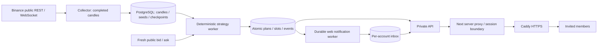

# Phases 6 and 7: private live operations

Completed core release: **0.7.0**, 4 October 2026. The owner replaced continuous paper observation with a live, signal-only production target. Paper defaults off, the observer was stopped, and its original/follow-up journals remain preserved. Telegram and AI are deferred to VPS deployment.

## Data and signal path

Strategy thresholds and risk arithmetic are unchanged. PostgreSQL transactions serialize source ingestion and publication by symbol. The engine rechecks evidence after the quote request; changed sources cannot become actionable plans. Reading old evidence also checks its saved lineages immediately, before a periodic withdrawal scan. Frozen levels/evidence remain available for inspection.

Each collector, engine and notification process holds a PostgreSQL advisory lock. A separate lease ownership token is checked under a row lock in every business transaction. Handoff waits for the old transaction; a stale owner cannot commit afterward. Leases are scoped by database schema and service. Losing ownership terminates the worker, while Docker restarts failed services. Local SQLite file locks remain a development path.

Web delivery uses committed event IDs as notification IDs, making retries idempotent. A restart can drain any backlog. Reads persist per account. The inbox polls every eight seconds; the worker polls every two seconds. The history endpoint uses time-plus-ID pagination, preserves exact backend Decimal strings and filters chosen market/direction. Downloaded CSV covers the loaded rows, explicitly labeled in the UI. Evidence download retains backend checksums.

## Access and operations

Owner bootstrap happens through the server CLI. Invitations are email/role bound, single use, hashed at rest and expire. Passwords use bounded Argon2id work; login/invitation/password limits persist in PostgreSQL. Sessions are opaque, hashed, revocable and expire within 12 hours. The server proxy keeps the service credential outside browser bundles; the browser receives only a Secure/HttpOnly/Strict host cookie. Writes require the configured exact origin.

Administrator, operator and viewer permissions are enforced in the API and reflected in the UI. Account changes revoke sessions; the last enabled administrator is protected by a serialized transaction. Membership, access, watchlist and operator changes produce audit records. Owner recovery is a private interactive server password prompt.

The website includes professional sign-in/invitation screens, account password/logout controls, member administration, audit history, durable notifications, full signal history and measured system status. Light/dark desktop/mobile views remain responsive. Production unavailability closes access and reports an error; it cannot substitute synthetic signals. The deliberate demo chart switch remains separately labeled.

The production stack contains PostgreSQL, migration, API, collector, engine, web delivery, Next standalone web, Caddy and scheduled backup services. Only Caddy publishes 80/443. App containers run unprivileged with bounded memory/logs and server-mounted secrets. Database schema health gates worker startup. A scheduled custom-format dump and checksum update measured backup status; readiness requires live workers, a configured owner and a current backup.

Maintenance blocks new signals and entry holds while preserving reads, ingestion, revisions, expiry and releases. No leveraged sizing, automatic fill inference, exchange order placement, AI inference or Telegram sending occurs in this release. Local Docker recovery tests demonstrate one-host resilience; multi-host failover, off-site transport and VPS endurance require deployment validation.

See [deployment procedure](PRODUCTION_DEPLOYMENT.md), [phase status](BUILD_STATUS.md) and [verification](VERIFICATION.md).
