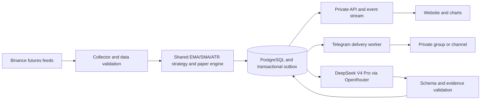

# MV Signal — EMA20 + EMA50 + SMA200 + ATR research and development plan

Research date: 3 October 2026, Asia/Kolkata. Revised at the user's request to use EMA20, EMA50, SMA200, and ATR.

This is the current plan. The original SMA50/100/200 proposal is retained in [the archived plan](ARCHIVED_SMA_50_100_200_PLAN.md) for historical comparison only.

Confirmed scope: Binance futures long/short signals for a personal/private group, delivered on a private website and Telegram, restricted to manually chosen coins. The approved symbol list is configurable; its actual members have not yet been supplied by the user. Proposed defaults: USDT-margined perpetual contracts, BTCUSDT and ETHUSDT first, 1-hour signal candles, and 4-hour trend confirmation. The user selected Binance and chosen-coins mode but has not explicitly confirmed the timeframes, individual symbols, hosting budget, or exit policy.

This is an implementation and validation plan. As of 4 October 2026, the first fixed [Phase 5 historical evaluation](PHASE5_RESULTS.md) has been exercised, with [method and limitations](PHASE5_BACKTESTING.md). It does not establish robust profitability. The [Phase 5.1 diagnostic/exit extension](PHASE51_DIAGNOSTICS_AND_EXITS.md) exercised two exit variants on already-viewed periods without promoting a winner. The [Phase 5.2 extension](PHASE52_FILTERS_AND_FORWARD.md) tested slope and separation independently and began a separate frozen forward shadow sample; neither historical filter established a reliable improvement and sufficient forward results remain unobserved. Broader candidate comparisons below remain a research roadmap; [build status](BUILD_STATUS.md) records implemented scope. Authenticated AI inference, bot registration, deployment and real-money trading remain unperformed. The proposed trading rules are hypotheses, not established profitable rules. A defect-free application cannot be guaranteed; reproducible calculations, strict validation, recovery, monitoring, and release gates are the practical objective.

## 1. Recommended product and division of responsibility

Build a private, continuously running market monitor with one deterministic EMA20/EMA50/SMA200/ATR14 strategy, AI explanations, a paper-trade ledger, and durable alert delivery.

The service monitors the exchange 24/7. DeepSeek receives fresh, timestamped snapshots when a relevant event occurs; an API model does not keep watching the market between requests by itself. Software must supply data and schedule requests.

Separate responsibilities:

| Component | Owns | Must not own |
| --- | --- | --- |
| Market collector | Futures candles, contract quotes, mark price, funding snapshots, freshness | Directional predictions |
| Strategy engine | EMA20, EMA50, SMA200, ATR14, entry triggers, deterministic exits, rule evidence | Unversioned discretionary changes |
| Risk/paper engine | Entry assumptions, frozen stop/target, paper fills and accounting | Claims about actual user fills |
| DeepSeek V4 Pro | Explain checked evidence; flag inconsistencies for inspection; summarize indicator regimes | Authoritative indicator arithmetic, invented prices, automatic strategy edits |
| Delivery worker | Persisted alerts, retry scheduling, Telegram status | Generating a second version of the signal |
| Website | Shared signal records, charts, history, status, administration | Private API keys or browser-side signal decisions |

This structure preserves the requested EMA20 + EMA50 + SMA200 + ATR strategy. If AI can select different entries or veto valid signals for discretionary reasons, that becomes a separate AI strategy and requires its own evaluation. Start that approach in shadow mode if desired. Model benchmark scores do not establish a trading edge.

## 2. Verified research findings

### DeepSeek and OpenRouter

The catalog lists `deepseek/deepseek-v4-pro-0813` as the GA V4 Pro model. The similarly named `deepseek/deepseek-v4-pro` entry refers to the older 0423 release. Pin the 0813 ID rather than a rolling latest alias. [OpenRouter models API](https://openrouter.ai/api/v1/models).

The public provider catalog returned 20 endpoints during research. Feature support and pricing vary across providers; test the selected route with a real request before launch. [V4 Pro provider catalog](https://openrouter.ai/api/v1/models/deepseek/deepseek-v4-pro-0813/endpoints).

The model page currently displays $0.22 per million input tokens and $4.20 per million output tokens for one available pricing combination, with other provider combinations listed. These are a dated cost reference, not a fixed rate for every route. [V4 Pro model page](https://openrouter.ai/deepseek/deepseek-v4-pro-0813).

OpenRouter documents JSON-schema responses and `provider.require_parameters: true`; validate responses locally even with schema enforcement. [Structured outputs](https://openrouter.ai/docs/guides/features/structured-outputs). Provider routing supports price ceilings and provider selection. [Provider routing](https://openrouter.ai/docs/guides/routing/provider-selection). Reasoning tokens consume output budget and remain billable when excluded from returned text. [Reasoning tokens](https://openrouter.ai/docs/guides/best-practices/reasoning-tokens).

### Binance futures

Current documentation routes futures candles and mark-price streams through `wss://fstream.binance.com/market`, while book tickers use `/public`. Older unrouted examples can miss market messages. Use the current mapping and verify actual payloads. [WebSocket migration notice](https://developers.binance.com/en/docs/products/derivatives-trading-usds-futures/websocket-market-streams/Important-WebSocket-Change-Notice).

Binance documents 24-hour WebSocket connections and ping/pong requirements. Planned rotation, reconnect, and reconciliation are required. [Futures connection documentation](https://developers.binance.com/en/docs/products/derivatives-trading-usds-futures/websocket-market-streams/Connect).

The futures REST catalog provides `/fapi/v1/klines`, `/fapi/v1/exchangeInfo`, `/fapi/v1/premiumIndex`, `/fapi/v1/fundingRate`, `/fapi/v1/fundingInfo`, and `/fapi/v1/markPriceKlines`. It exposes symbol filters and adjusted funding intervals. Read actual contract metadata and funding timestamps rather than assuming identical precision or funding schedules. [USDⓈ-M market data](https://developers.binance.com/en/docs/catalog/core-trading-derivatives-trading-usd-s-m-futures/api/rest-api/market-data).

Binance publishes daily/monthly futures history and checksum files; archives may receive corrections. Snapshot downloaded datasets and record checksums. [Official public-data repository](https://github.com/binance/binance-public-data).

### Telegram

BotFather creates the bot and provides its token; our backend implements its behavior. Users must initiate a private bot conversation before receiving direct messages. [Bot introduction](https://core.telegram.org/bots).

Telegram documents approximate default broadcast limits of 30 messages/second, about one message/second per chat, and 20 messages/minute in a group. Design a per-destination queue. [Bots FAQ](https://core.telegram.org/bots/faq).

The Bot API supports a webhook secret header and provides `retry_after` for flood-control responses. [Telegram Bot API](https://core.telegram.org/bots/api).

### Strategy evidence and calculation compatibility

EMA gives more weight to recent prices than an equivalent-period SMA; faster response can also introduce more short-term changes. It remains a lagging indicator. [Fidelity EMA guide](https://www.fidelity.com/learning-center/trading-investing/technical-analysis/technical-indicator-guide/ema).

ATR measures range volatility, including gaps, and does not indicate direction. ATR14 is a common convention; the documented Wilder recurrence uses a smoothing factor of 1/14. Use it for volatility-scaled risk distance. [Fidelity ATR guide](https://www.fidelity.com/learning-center/trading-investing/technical-analysis/technical-indicator-guide/atr).

The EMA's usual span coefficient is 2/(n+1). pandas exposes both adjusted weighting and a recursive calculation initialized at the first observation; choosing adjust=False alone does not implement the SMA-seeded convention specified below. [pandas ewm reference](https://pandas.pydata.org/docs/reference/api/pandas.DataFrame.ewm.html).

TA-Lib explicitly marks EMA and ATR as having unstable periods. Standardize initialization, history origin, and warm-up rather than assuming every indicator library or chart gives identical values. [EMA documentation](https://ta-lib.github.io/ta-lib-python/func_groups/overlap_studies.html), [ATR documentation](https://ta-lib.github.io/ta-lib-python/func_groups/volatility_indicators.html).

Research on backtest overfitting shows why selecting a winner from many configurations can produce misleading performance. Keep a trial log and evaluate chronological forward periods; a single attractive historical chart is insufficient. [Bailey et al., The Probability of Backtest Overfitting](https://www.davidhbailey.com/dhbpapers/backtest-prob.pdf).

### Feasibility checks performed

Two unauthenticated requests from the current development computer succeeded: Binance futures server time and the OpenRouter V4 Pro provider catalog. This verifies basic connectivity from this computer only. Production-region connectivity, the exact WebSocket payloads, provider schema behavior, and account-funded inference remain launch checks.

Some older Binance stream-specific documentation URLs redirected to the documentation homepage during research. Use the current official route notice, REST catalog, and live contract fixtures; do not treat a successful HTTP response from a redirected documentation page as proof that a stream integration works.

## 3. Initial scope

Included:

- Binance USDT-margined perpetual crypto contracts, starting with BTCUSDT and ETHUSDT.
- Long and short setup alerts using EMA20, EMA50, SMA200, and ATR14 as specified below.
- Closed 1h entries and closed 4h confirmation, proposed defaults.
- Private responsive website, invite-only access, and admin role.
- Private Telegram group or channel, plus optional linked direct messages.
- Signal history, rule evidence, immutable versions, delivery records, and paper performance.
- Continuous monitoring of paper stop/target crossings and hourly trend exits.
- Admin pause for new entries, independent health monitoring, and backups.

Deferred:

- Automatic order placement, exchange account integration, and trade-enabled Binance keys.
- Payment processing and public subscriptions.
- Many exchanges, hundreds of contracts, discretionary news analysis, and extra indicators.
- Personalized leverage recommendations or purported profit probabilities.

Signal-only scope requires market data, an OpenRouter key, and a Telegram bot token. Users place and manage their own exchange orders. A website alert or a Telegram message does not place a protective stop on Binance.

## 4. Strategy contract: EMA-PULLBACK-ATR-v1

Use EMA20 for the short-term price reclaim/loss, EMA50 for intermediate trend and trend exits, SMA200 for the broader direction, and ATR14 for the initial risk distance. This is the proposed research baseline, not a proven improvement over the original SMA plan.

Initial market/timeframe defaults remain Binance USDT perpetual BTCUSDT and ETHUSDT, 1h entries, and 4h confirmation. All directional decisions use completed futures contract-trade candles. Mark-price history is a distinct series.

### Indicator definitions

Use close for EMA20, EMA50, and SMA200. Use high, low, and previous close for ATR14. The 1h ATR controls 1h signal risk; do not substitute the 4h ATR. Compute 4h EMA20, EMA50, and SMA200 independently from actual 4h candles, not by sampling 1h indicators.

For EMA period n in {20, 50}:

```text
alpha = 2 / (n + 1)
EMA_n(n-1) = mean(C_0, ..., C_(n-1))
EMA_n(t) = alpha * C_t + (1-alpha) * EMA_n(t-1)
```

The seed uses the first n closes after the documented history origin. Values before the seed are unavailable.

For SMA200:

```text
SMA200(t) = sum(C_(t-199), ..., C_t) / 200
```

For Wilder ATR14, with history starting at candle 0 and first valid true range at candle 1:

```text
TR_t = max(H_t-L_t, abs(H_t-C_(t-1)), abs(L_t-C_(t-1)))
ATR14(14) = mean(TR_1, ..., TR_14)
ATR14(t) = (13 * ATR14(t-1) + TR_t) / 14
```

The initial previous-close requirement and seed indices are part of the contract. A simple rolling mean of the latest 14 true ranges, or an EMA with span=14, is a different ATR implementation.

Parse market values as decimal strings. Use a fixed, documented calculation precision and rounding mode; never round indicator values for strategy comparisons. Display rounding is separate. Record indicator implementation version, smoothing, seeds, and history origin in every research manifest.

### Regimes and timeframe synchronization

1h bullish regime: `EMA20(t) > EMA50(t) > SMA200(t)`.

1h bearish regime: `EMA20(t) < EMA50(t) < SMA200(t)`.

Equality or mixed ordering produces no new entry. ATR is not part of bullish/bearish ordering.

For confirmation, use the most recent complete, validated 4h candle whose end boundary is no later than the 1h decision boundary. At a shared close, wait for that expected 4h candle to finalize, with a bounded freshness deadline; do not choose different confirmation data based on arrival order. Reproduce the specified availability delay in historical replay.

### Long setup

All conditions must hold:

1. The current 1h regime is bullish: EMA20 > EMA50 > SMA200.
2. The eligible closed 4h regime is also bullish, and its close is above its EMA20.
3. Previous 1h close was at or below its contemporaneous EMA20: `C(t-1) <= EMA20(t-1)`.
4. Current closed 1h candle reclaims EMA20: `C(t) > EMA20(t)`.
5. 1h ATR14 is available, finite, and positive; all data-quality, warm-up, publication, and quote checks pass.
6. No active paper position or active setup exists for the symbol and strategy.

This is a close-to-close reclaim. An intrabar wick touching EMA20 alone does not qualify. Requiring a fresh EMA20/EMA50 crossover as well would create another strategy, so it is not a condition here.

### Short setup

Mirror the long rules:

1. Current 1h ordering is EMA20 < EMA50 < SMA200.
2. The eligible closed 4h candle has the same bearish ordering and close below EMA20.
3. `C(t-1) >= EMA20(t-1)`.
4. `C(t) < EMA20(t)`.
5. ATR, data, quote, timing, and state checks pass.

### Why this baseline and what it cannot establish

The averages provide directional context, and the EMA20 reclaim/loss defines a new entry event. ATR supplies a price-unit risk distance that changes with measured volatility. This assigns a distinct use to each requested indicator.

Faster response can increase opportunities and false entries. SMA200 and 4h confirmation may exclude some ranges but can also delay entries. New setups may have wider initial ATR stops after a volatility spike without a more reliable direction; existing baseline stops remain frozen. The net benefit must be measured after costs.

### Warm-up, restart state, and exclusions

- SMA200 needs 200 contiguous completed closes; a previous full snapshot needs 201. The cold-start policy requires at least 500 completed candles on each used timeframe before signaling.
- SMA200 on 1h represents 200 hours; on 4h it represents 800 hours, about 33.3 days. EMA values include a decaying influence from earlier history, so they do not have an exact finite lookback equal to their period.
- Use a documented canonical history origin for each dataset and instrument. Cold-start seeds and the 500-bar exclusion follow that origin.
- Persist EMA20, EMA50, ATR14, their last processed candle, previous close, SMA200 rolling window, and source lineage in a checkpoint. On restart, restore the checkpoint and replay subsequent validated candles; do not reseed from the latest 500 bars.
- For a corrected candle, replay recursive indicators from a valid checkpoint preceding the correction. Indicators must not retain state computed from superseded prices.
- Live, historical replay, and chart data use the same seed convention and indicator implementation. If comparing with a third-party chart/library, align history and initialization and document any remaining differences.
- Do not create retroactive entries when startup happens inside an established trend. One paper position per symbol/strategy; no pyramiding or same-candle reversal.
- After an exit, require a new EMA20 reclaim/loss event on a later closed candle.
- RSI, MACD, ADX, volume-based direction, sentiment, slope filters, and EMA-gap thresholds are outside this baseline. Optional additions require separate versions and experiments.
- Display `ATR_percent = 100 * ATR14 / close` as volatility context; there is no universal high/low ATR-percent threshold in the baseline.

## 5. Entry, stop, target, and exit policy

Freeze the entry/risk convention before assessing performance. Proposed constants below are starting hypotheses, not optimized values.

### Publication and entry reference

After the closed-candle decision, read a fresh futures best bid/ask. Long entry reference E is the ask; short E is the bid. Store E and the quote time separately from the source candle close C(t).

Proposed entry validity: 5 minutes after the source candle boundary. Quote freshness: at most 5 seconds. Expired recovery events enter the audit history and never send as current entry opportunities.

Proposed entry-drift check: `abs(E - C(t)) <= 0.5 * A`, where A is the source candle's frozen 1h ATR14. This limits how far the actionable quote can move from the tested setup. Record failures as MISSED_ENTRY_PRICE_DRIFT and include them in research. Its 0.5 multiplier is part of the versioned execution policy and should be tested with realistic delay; it is not established optimal.

Require the quote to remain on the entry side of EMA20(t): E > EMA20(t) for long, E < EMA20(t) for short. Validate spread, market status, and contract metadata. No arbitrary volatility/spread threshold may be silently added to the directional strategy.

Keep the published plan immutable. A subscriber may obtain a different fill; distinguish the reference quote, modeled paper fill, and any user-reported real trade. Never treat a sent message as evidence of an exchange fill.

### Risk policy RISK-ATR14-2X-2R-v1

Freeze `A = ATR14_1h(t)` from the completed signal candle. Use the following initial distances:

```text
Long:  S_raw = E - 2*A
Short: S_raw = E + 2*A
```

Round the stop to the contract tick: down for long, up for short. Then calculate actual positive `R = abs(E-S)` from the rounded stop:

```text
Long:  TP_raw = E + 2*R
Short: TP_raw = E - 2*R
```

Round target down for long and up for short so the displayed reward is not exaggerated. Validate S > 0, R > 0, and correct geometry; otherwise block the setup. Recompute displayed distance and reward/risk after rounding.

- Use one full-position 2R target initially; no partial targets, breakeven moves, or trailing stops.
- Freeze the initial ATR and stop. Increasing ATR after entry must never widen the stop or increase the initially planned loss.
- Intrabar stop and target observations use futures contract-trade price; mark price is kept separate. A stop-trigger crossing is not a guarantee of the simulated or actual fill price.
- Additional trend exit: on a completed 1h candle, exit a paper long if close <= current EMA50; exit a paper short if close >= current EMA50.
- Execute a trend exit at the next eligible modeled price after its decision, not retrospectively at the deciding close. The fixed intrabar stop remains active between closes.
- First applicable exit wins. If source data cannot determine event order, record uncertainty and use conservative reporting.

A 2ATR stop and 2R target imply roughly 4ATR gross reward before tick adjustments and costs. This does not mean the market is likely to reach that distance. A comparison variant may use ATR trailing, but it requires an exact ratchet/update rule and separate evaluation.

### Sizing and leverage

For a linear USDT contract, approximate base-asset quantity before costs is `user_loss_budget_USDT / R`. Include estimated entry/exit fees and adverse-fill allowance, round quantity down to the contract step size, and validate minimum notional. Show the assumed budget instead of selecting an account risk percentage for the user.

Holding the loss budget fixed means larger ATR usually produces smaller quantity, while smaller ATR can produce larger quantity. Apply configurable user notional and margin limits so a narrow stop cannot imply an impractically large position. An ATR-based stop does not guarantee liquidation occurs later than the stop.

DeepSeek must not choose account-specific leverage. Liquidation depends on actual account mode, collateral, maintenance requirements, position size, and other positions, which v1 does not know. Report price-distance risk and unlevered/notional paper performance separately from account return on margin.

Funding may debit or credit a held position. Use actual funding events and mark-price notional at those times in simulation. Funding remains cost/context data, not a directional filter in this indicator-based baseline.

### Fictional arithmetic example

If the long reference quote E = 100,000 USDT and source ATR14 A = 500 USDT, then the unrounded stop is 99,000, R = 1,000, and 2R target is 102,000. This is illustrative arithmetic, not a current market signal or a projected outcome.

## 6. Market-data collection and recovery

### How a signal is triggered and delivered

The strategy engine, not an AI response, originates a signal. It is an always-on backend process operating only on the approved, manually chosen contracts. The website does not need to remain open for it to run.

On each completed 1h candle, the collector supplies validated data to the common strategy package. The engine synchronizes the required completed 4h evidence, updates EMA20/EMA50/SMA200/ATR14, and evaluates the exact versioned long/short rules. The result is LONG_SETUP, SHORT_SETUP, NO_SETUP, or BLOCKED_DATA, with a reason for every condition. An ongoing trend without a fresh EMA20 reclaim/loss is NO_SETUP.

If a setup passes, the engine checks position state, expiry, quote freshness, price drift, instrument eligibility, and price geometry. It computes the reference entry and frozen ATR stop/target. In one database transaction, it records the signal, deduplication identity, paper-state event, and delivery intent. The website receives the committed record; the Telegram worker sends the same signal record. Their financial levels are never copied from model-generated prose.

The AI-review job is separate. DeepSeek receives the recorded evidence and may add a validated explanation. A signal initially shows AI REVIEW PENDING and uses a deterministic rule-based explanation. Timeout or rejected AI output produces an explicit review status without suppressing or changing the strategy signal. AI disagreement is an admin/shadow-review event in v1.

Stop and target observations for open paper positions run between hourly closes; EMA50 trend exits are evaluated on completed 1h candles. These generate separate exit events linked to the original signal. They do not prove that a subscriber holds a real exchange position or place actual exchange orders.

### Initial feeds

Market route examples:

```text
wss://fstream.binance.com/market/stream?streams=btcusdt@kline_1h/btcusdt@kline_4h/btcusdt@markPrice@1s/btcusdt@aggTrade
```

Add equivalent ETH streams. The best-bid/ask stream belongs on the public route:

```text
wss://fstream.binance.com/public/stream?streams=btcusdt@bookTicker/ethusdt@bookTicker
```

These examples follow the researched routing notice; validate exact subscriptions and payload schemas in an integration spike before treating them as production-ready configuration.

Closed-candle handling must validate the futures payload close flag, conventionally `k.x == true`, alongside symbol, interval, start/end boundaries, and timestamps. Capture an actual closed futures payload as a fixture. Open candles may animate charts, but never drive confirmed strategy entries.

Use UTC boundaries internally. Convert timestamps to Asia/Kolkata only for presentation. Use an exclusive candle end boundary internally even when the exchange reports an inclusive last millisecond.

### Processing order

1. Normalize and validate an incoming event.
2. Store finalized candles keyed by venue, product, symbol, interval, and open time.
3. Check sequence continuity and warm-up.
4. Wait for required cross-timeframe finalization.
5. Compute the indicator snapshot and rule evidence using the shared strategy package.
6. Under a database transaction and a symbol/strategy lock, store the evaluated decision, resulting paper state transition, signal, and outbox jobs.
7. Publish website events only after commit; run AI and Telegram jobs independently.

Avoid saving every transient price update to PostgreSQL. Keep latest quotes in bounded memory, persist decision snapshots, finalized small candles, and paper position events. Retain granular historical execution data as compressed files for research.

### Reconnect and reconciliation

- Keep heartbeats, last event time, last finalized candle, and processing watermarks per feed.
- Rotate the WebSocket before its documented connection lifetime; overlap feeds briefly and deduplicate.
- Reconnect with exponential backoff and jitter.
- On restart, open and buffer the stream, backfill the REST gap through the latest completed candle, merge/deduplicate buffered events, and resume ordered processing.
- Respect REST weight limits and response headers; honor retry guidance and IP-ban responses.
- Do not forward-fill missing candle prices to fabricate history.
- If a data gap cannot be resolved, pause new entries for that symbol and surface the gap.
- If paper positions were open during the gap, reconcile granular prices where possible. If stop/target order remains unknowable, mark the outcome as uncertain rather than assigning a profitable fill.
- Recover position state from persisted events and indicator state from compatible checkpoints plus ordered replay. Backfill may update history, but must not send old entry alerts as current opportunities.
- If a finalized candle is later corrected, version the candle, rebuild subsequent EMA/ATR state from a preceding valid checkpoint, and append an explicit correction record. Preserve the original signal evidence and original backtest dataset.

## 7. DeepSeek integration contract

Use server-side HTTPS requests to OpenRouter's chat-completions API with the pinned model ID. Keep this integration small; a general-purpose autonomous agent framework is unnecessary for a fixed indicator strategy.

### Invocation policy

- Continuous collector and strategy evaluation run regardless of AI availability.
- Invoke DeepSeek on new entry/exit evidence, plus an optional batched hourly EMA/SMA-regime and ATR-context summary.
- No model request per tick, per website visitor, or per subscriber.
- Cache a completed review by evidence hash, model ID, and prompt version.
- Publish the deterministic signal immediately with an honest AI-review state; attach the validated explanation later.
- AI disagreement is a shadow audit event and an admin diagnostic in v1. It does not silently cancel the deterministic strategy.

### Input

Provide structured facts only: signal ID, snapshot hash, versioned rule IDs, venue/product/symbol, source timestamps, completed-candle OHLC, EMA20/EMA50/SMA200/ATR14 values, calculation versions, comparisons, freshness state, frozen ATR and stop/target policy, and funding context identified as nondirectional.

Do not send user balances, identifiers, bot credentials, exchange credentials, unrestricted URLs, news articles, or editable third-party instructions. Charts are unnecessary: numeric candle and indicator evidence is more precise for this task.

### Output

Suggested strict schema:

```json
{
  "signal_id": "immutable-id",
  "snapshot_hash": "sha256-of-input-evidence",
  "review_status": "consistent",
  "evidence_rule_ids": ["H1_EMA_BULL_ORDER", "H4_BULL_CONFIRM", "H1_RECLAIM_EMA20", "ATR14_VALID"],
  "summary": "The completed hourly candle reclaimed EMA20 while both timeframes retained bullish EMA20/EMA50/SMA200 ordering; the stop distance uses frozen ATR14.",
  "limitations": ["Moving averages lag price; ATR measures volatility without confirming direction."]
}
```

Allow only documented statuses such as consistent, inconsistent, or insufficient_data. Evidence IDs must exist in the supplied snapshot. Prices, direction, stop, target, risk, and timestamps remain owned by the deterministic signal record. Prefer no new numeric values in AI prose. Reject prose that introduces extra indicators or unsupported probability claims.

### Runtime controls

- Inspect model/provider supported parameters during startup and smoke tests.
- Request JSON schema with strict enforcement and require compatible provider parameters.
- Apply local schema validation and semantic checks against the immutable evidence snapshot.
- Use supported low-effort reasoning or disable it for simple narrative work after compatibility testing; validate token controls on the actual provider.
- Set an initial 30-second request timeout and a bounded retry policy within a 60-second annotation deadline. These are operational starting targets, not measured provider guarantees.
- On timeout, malformed output, cost exhaustion, or all providers failing, retain the deterministic signal and display unavailable/rejected review status.
- Route only to a tested provider allowlist, with same-model fallback and maximum per-token prices. Do not silently substitute another model.
- Record provider, model, request ID, prompt/schema versions, input hash, output, validation status, latency, token usage, and cost.
- Budget and circuit-break AI independently from the core strategy service.

Low temperature is not a guarantee of repeatable model output. Determinism comes from the strategy and validation, not from a model setting.

## 8. Application architecture

Use a modular backend with independently supervised processes, rather than a large distributed microservice system.



| Layer | Recommendation | Reason |
| --- | --- | --- |
| Web | Next.js, React, TypeScript | Responsive dashboard and typed client contracts |
| Charts | TradingView Lightweight Charts | Candles, EMA20/EMA50/SMA200 lines, ATR pane, markers, and price levels |
| Backend API | Python FastAPI and Pydantic | Typed validation close to the strategy/research code |
| Strategy | Pure Python package using Decimal at defined precision | One implementation reused in replay, live evaluation, and tests |
| Historical analysis | pandas/NumPy for preparation and metrics; event replay for decisions | Convenient analysis without a separate live trading rule implementation |
| Persistence | PostgreSQL, SQLAlchemy, Alembic | Transactions, durable history, schema migrations |
| Jobs | PostgreSQL outbox with row locking, leases, bounded retries | Durable small-volume work without an additional queue dependency |
| Live web updates | Server-Sent Events with replay cursor and REST resync | Dashboard traffic primarily flows server to browser |
| Deployment | Docker containers, always-on API and workers, managed PostgreSQL | Persistent feed connections and restart recovery |
| Quality | pytest, property-based strategy tests, Playwright, lint/type checks | Financial behavior, integration, and UI coverage |

FastAPI documents its Pydantic integration. [FastAPI features](https://fastapi.tiangolo.com/features/). Lightweight Charts requires TradingView attribution and a link; include both and satisfy the package NOTICE requirements. [Chart license/attribution](https://tradingview.github.io/lightweight-charts/docs/5.0).

Redis/Valkey is optional later for cache or fanout; it must not become the only location of durable signal or delivery state. Scale only when measured load warrants it.

Suggested repository layout:

```text
apps/web/
services/api/
services/collector/
services/delivery/
packages/strategy/
research/
tests/fixtures/
infra/
docs/
```

These are logical code boundaries. Collector, AI, and delivery can use one Python image with separate process commands. CPU-heavy backtests run in a separate research process so they cannot block live ingestion.

## 9. Data model and state

Core tables:

| Entity | Key content |
| --- | --- |
| instruments | Venue, product, symbol, perpetual status, quote/margin asset, filters, effective metadata version |
| candle_revisions | Symbol/timeframe/boundary, OHLCV, source, ingestion time, revision and quality |
| indicator_checkpoints | Recursive EMA/ATR state, SMA window, previous close, history origin, processed boundary, source revision lineage |
| indicator_snapshots | Candle revisions, decimal EMA20/EMA50/SMA200/ATR14 values, seed/history lineage, available-at times, evidence hash |
| strategy_versions | Rule specification, risk policy, parameters, code commit, activation time |
| decisions | Snapshot, strategy version, every rule outcome, action, block reason |
| signals | Immutable plan, reference quote, frozen ATR, stop multiplier, stop, target, source and publication times, expiry |
| signal_events | Published, expired, superseded, corrected, paper-entered, paper-exited |
| paper_positions | Original plan, modeled fill, current status, cumulative costs and event cursor |
| paper_events | Fill/exit assumptions, price observations, funding, fees, uncertainty |
| ai_reviews | Input hash, model/provider, validated output, status, latency and cost |
| users/subscriptions | Invite-based role and watchlist/preferences |
| telegram_links/destinations | Verified user binding or configured group/channel ID |
| outbox/deliveries | Destination, event ID, lease, attempts, status, message ID, next retry |
| audit_log | Administrative changes and security-relevant actions |

Use a unique entry-decision identity including venue, product, symbol, timeframe, source candle boundary, strategy version, and action. A duplicate source event cannot create a second decision or entry. Signal events and delivery identities include event sequence and destination.

Hold a database lock or equivalent transactional state ownership for each symbol/strategy before checking and changing position state. Database uniqueness alone is insufficient to prevent conflicting distinct entries from concurrent workers.

Separate state dimensions:

- Data: warming, healthy, stale, gap, paused.
- Setup: candidate, published, expired, invalidated.
- Paper position: open, target_exit, stop_exit, trend_exit, uncertain.
- AI: pending, validated, rejected, unavailable.
- Delivery: queued, sending, accepted, retryable_failure, permanent_failure, ambiguous.

Telegram accepting a message is not proof that a person received or read it. A paper position is not proof a subscriber entered a real trade.

## 10. Website experience

Private login and role-based controls first. For a small private group, invite-only identity-provider login is preferable to building a custom password recovery system.

Pages:

1. Dashboard: latest confirmed long/short signals, neutral/watch states, source freshness, last successful processing, open paper positions.
2. Market chart: correct futures instrument, 1h/4h candles, EMA20/EMA50/SMA200 overlays, 1h ATR14 and ATR-percent context, historical signal markers, frozen ATR paper stop/target, separate contract/mark price labels. Open candles are visibly provisional.
3. Signal details: exact rule checklist, source candle and publication time, entry reference time, expiry, stop/target policy, AI review state and explanation, shared signal ID.
4. History: all published, expired, corrected, and closed signals, including losses and uncertain events.
5. Paper performance: net expectancy, drawdown, trade count, time range, costs, exposure, and assumptions; separate historical backtest from forward paper results.
6. Settings: symbols, notification preferences, Telegram linking, local display timezone.
7. Admin: instrument allowlist, version activation, pause new entries, retry failed deliveries, service health, AI spend, audit trail.

Signal prices and status come from the backend record. The chart can render server-calculated EMA/SMA/ATR points, but must not create a second trading calculation in JavaScript.

Use ordinary language: LONG SETUP, SHORT SETUP, NO SETUP, DATA STALE, AI REVIEW PENDING. Avoid uncalibrated labels such as 95% confidence or guaranteed profit. Include an accessible table alternative for chart evidence.

## 11. Telegram workflow

1. Create the production bot with `/newbot` in the official BotFather account; obtain its token through secure configuration.
2. Create a separate development/staging bot.
3. Add the production bot to the private group, or give it posting permission in a private channel. Record the numeric chat ID and any topic/thread ID; do not route by changeable username alone.
4. For personalized DMs, the logged-in website issues a short-lived, single-use linking token. Open `t.me/<bot>?start=<token>` and bind the received Telegram sender ID after validating that token. Never trust a claimed user ID from the URL.
5. Register a HTTPS webhook with a random secret token; check its secret header, constrain payloads, deduplicate update IDs, persist incoming work, and return promptly.
6. Implement `/start`, `/help`, `/status`, `/subscribe`, `/unsubscribe`, and `/signals`. Limit administrative controls to explicitly authorized Telegram IDs or keep them in the website.
7. Render alerts from the same persisted signal/event template used by the website. Escape Telegram formatting and use verified deep links.
8. Queue sends per chat and globally; honor `retry_after`, apply bounded retries, disable destinations after permanent blocked/permission errors, and expose failures in the admin panel.

For a small group, a single private channel/group simplifies delivery. Group members do not each need to start the bot for group posts; DM subscribers do.

### Delivery semantics

Use a transactional outbox: signal persistence and the intent to notify commit together. The worker claims a leased job, sends it, and records Telegram's returned message ID.

There is a failure window if Telegram accepts a send but the response is lost. The Bot API's normal sendMessage interface does not provide an application idempotency key for guaranteed exactly-once delivery. Record ambiguous results, allow a bounded resend with the same visible signal ID, and disclose that rare duplicates can occur. Never advertise guaranteed exactly-once Telegram delivery.

Use the original message ID to edit status when known, and send exit/correction replies with the signal ID. Rate limits apply to updates too. If an AI explanation arrives late, update the website first; do not flood the group with extra messages.

Example format, using fictional values only:

```text
MV SIGNAL — LONG SETUP
Binance BTCUSDT · USDT perpetual
Entry timeframe: 1h · Trend: 4h

Signal close: 100,000 USDT
Entry reference: 100,010 USDT (ask at publication)
ATR14 at signal: 500 USDT (1h, Wilder smoothing)
Initial stop: 99,010 USDT (2 x frozen ATR14 from reference)
Target: 102,010 USDT (2R before costs)
Stop/target observation: contract price
Entry validity: 5 minutes after signal candle close

Reason: 1h close reclaimed EMA20; bullish EMA20 > EMA50 > SMA200 on both timeframes.
AI review: Pending / validated explanation available on website
ID: unique-signal-id
Source candle / publication timestamps: explicit UTC and IST
Open details: verified website link
Paper plan; orders are managed by the user on Binance.
```

## 12. Backtest and research protocol

Software correctness and strategy profitability require different evidence. Both must be evaluated.

### Dataset

- Obtain several years of BTCUSDT/ETHUSDT perpetual history where available, including differing trend and range periods.
- Use futures contract data throughout; do not substitute spot history.
- Load warm-up history before each evaluation interval.
- Keep 1h/4h strategy candles plus granular execution history, preferably trades for precise event order or at least 1m candles.
- Obtain actual funding history. For liquidation studies or mark-trigger simulations, obtain corresponding mark-price history and account/margin assumptions.
- Verify checksum, timestamp units, boundaries, duplicated rows, gaps, symbols, and extreme values. Record coverage limitations.
- Store dataset manifest, source URL, checksum, importer version, research commit, and availability cutoff. Never use data later than the research cutoff.

### Experimental design

Register a small candidate set before examining results:

| Candidate | Difference |
| --- | --- |
| A: primary baseline | 1h EMA20 reclaim/loss, ordered EMA20/EMA50/SMA200, 4h confirmation, frozen 2ATR14 stop, full 2R target, EMA50 trend exit |
| B: confirmation ablation | Same strategy without the 4h confirmation |
| C: exit ablation | Same as A without fixed 2R target; retain frozen 2ATR14 stop and EMA50 trend exit |
| D: alternate trigger | Same risk/publication policy as A; replace EMA20 price reclaim/loss with a fresh EMA20/EMA50 cross, preserving current directional and 4h filters |
| E: original-plan benchmark | Archived SMA50/100/200 strategy with its original risk policy; disclose that both entry and exit rules differ |

A is a starting hypothesis, not a winner chosen in advance.

Test ATR stop multipliers 1.5, 2.0, and 2.5 in a small separately logged sensitivity study while holding the remaining rules fixed; do not initially sweep every combination of period, timeframe, filter, and exit. The archived original-plan comparison evaluates a complete strategy change, not the isolated effect of replacing SMAs with EMAs.

For crossover candidate D, long requires EMA20(t-1) <= EMA50(t-1) and EMA20(t) > EMA50(t); short uses the inverse inequalities. Retain the current-bar ordering, close-above/below-EMA20, 4h confirmation, ATR, and execution checks. Do not combine pullback and crossover with an untested OR rule.

An optional ATR trailing variant remains deferred. If later tested, update only after a completed candle, use the prior active stop during that candle, ratchet upward for a long/downward for a short, and activate the new level only after its update time. Do not retroactively use that candle's high/low and freshly calculated ATR to claim an earlier trailing exit.
 Avoid testing a large grid until a real need is demonstrated. Record every trial, including failures and abandoned variants. If the search expands substantially, use a multiple-testing/selection-bias method such as PBO or deflated Sharpe in addition to chronological validation.

Use chronological development, validation, and untouched final evaluation segments, with rolling forward windows to assess stability. Prevent overlapping trades from leaking between evaluation partitions. Historical public data is only out of sample with respect to the chosen research procedure, not necessarily unknown to the developer or model. Forward paper trading supplies stronger unseen evidence.

### Execution and costs

- Evaluate only completed candles. Use only 4h information already complete and available at the decision.
- Fill after decision/publication latency. Never take the closing price that was required to discover the setup as an assured executable fill.
- If only 1m execution bars are available, use the next eligible bar after simulated alert availability, then a documented spread/slippage model. Label this resolution approximation.
- Use taker fees for market-style entries/exits unless an explicit limit-fill model supports maker fills. Fees are user-tier dependent; do not hardcode a universally applicable Binance fee.
- Apply funding debits/credits at actual timestamps for the held direction and size.
- Include trade spread, adverse slippage, gap behavior, and notification delay sensitivity.
- If stop and target occur within the same execution bar and order is unknown, seek finer data; otherwise use a conservative stop-first result and show sensitivity/ambiguity counts.
- Do not assume a stop fills exactly at its level during a gap.
- Default strategy comparison to unlevered notional returns. Do not simulate leveraged liquidation using a simple inverse-leverage percentage shortcut.
- Test simultaneous BTC/ETH exposures at portfolio level; individual trade results do not measure combined drawdown.

### Report

Report net P&L, net expectancy per trade and in R, win rate, average win/loss, profit factor, maximum drawdown, time under water, trade counts, exposure, holding time, turnover, funding contribution, costs, MAE/MFE, long-versus-short breakdown, symbol/regime breakdown, and uncertainty intervals using a method that respects temporal dependence.

Compare with no-trade/cash and an appropriately costed passive futures exposure, stating the exposure assumptions. Inspect whether the apparent edge survives plausible extra fees, worse slippage, and later fills.

Do not optimize for win rate alone. A small number of signals is not enough to establish a stable edge. An inconclusive result stays research-only; it does not become evidence of profitability because the software functions correctly.

## 13. Tests that matter

### Mathematical and strategy tests

- Hand-calculated EMA20/EMA50/SMA200/ATR14 fixtures with known seed, recurrence, and decimal results.
- Recursive EMA/ATR and rolling SMA implementations match independent oracles across generated sequences with the same seeds and history origin. Verify true range with gaps, Wilder rather than span-14 smoothing, and first-valid-value indexing.
- Equality, ties, warm-up, and missing data produce documented states.
- Modifying an open candle cannot change a confirmed signal.
- Appending future data cannot change a decision already made on a historical prefix.
- At a shared close, stream arrival order cannot select different 4h evidence.
- Checkpoint restore plus replay reproduces uninterrupted EMA/ATR values and decisions; reseeding from a sliding recent window is forbidden. A corrected historical candle triggers a rebuild of downstream recursive state.
- Both long and short mirrors use contemporaneous EMA/SMA comparisons; ATR contributes risk distance and never direction.
- EMA20 reclaim is distinct from intrabar touch or a fresh EMA20/EMA50 crossover; steady alignment produces no repeated entry. Quote drift and expiry rejection use the frozen source ATR.
- ATR freeze, stop/target geometry and tick rounding, quantity steps, notional caps, fees, and funding cash flows are correct. Rising ATR after entry never widens the baseline stop.
- First exit wins; ambiguous intrabar order is recorded and conservatively modeled.

### Integration and failure tests

- Actual Binance futures fixtures validate market/public routing, symbol metadata, contract versus mark price, and closed-candle schema.
- Duplicate and reordered events, stream rotation, reconnect, missing candles, and late corrections.
- Two workers racing on the same symbol; no conflicting position state.
- Process crash between each transactional and delivery step; persisted intent is recoverable.
- Expired recovered entries do not send as live alerts.
- OpenRouter timeouts, rate limits, unsupported parameters, malformed JSON, schema-valid but incorrect evidence, truncated content, and exhausted credit.
- Telegram 429, retry_after, permission loss, blocked users, timeouts with unknown send status, and webhook replay.
- Database unavailable, full disk, dropped SSE connections, and backup restoration.

### UI and security tests

- Private access and user/admin boundaries.
- Telegram link token replay, expiry, and cross-account misuse.
- Secrets absent from client bundles, API errors, logs, and network payloads.
- The same signal ID, prices, expiry, and event status appear in web and Telegram.
- Correct UTC/IST display, mobile layout, keyboard access, and stale-data banners.
- Losses, expired signals, corrections, and uncertain paper outcomes remain visible.

Coverage goals should focus on these invariants and failure paths, not a headline percentage or tests that repeat the implementation without an independent oracle.

## 14. Security and operations

- Keep OpenRouter and Telegram credentials in server-side secret configuration; use separate environments and tokens, redaction, rotation, and least-privilege access.
- Do not put tokens in NEXT_PUBLIC variables or Telegram URLs written to logs.
- Authenticate APIs and SSE; use secure sessions, CSRF protection where applicable, explicit allowed origins, rate limits, and parameterized queries.
- Protect administrator access with MFA through the selected identity provider.
- Render AI text as escaped text or sanitized Markdown; never treat it as executable HTML or instructions to tools.
- Send no subscriber personal data to the model.
- Pin runtime dependencies in lockfiles; run vulnerability/secret checks and reviewed database migrations.
- Encrypt transport and protect database access on private networks or strict access lists.
- Store audit events for version changes, destination changes, pauses, and retries.
- Maintain automated backups with a separate restore exercise. Set retention and deletion rules for Telegram linking data.
- Support a pause-new-entries control without silently abandoning existing paper positions or hiding their outcomes.

Initial engineering targets, to be measured during paper operation:

| Metric | Starting target |
| --- | --- |
| Healthy eligible closed-candle decision to website | p95 under 10 seconds after required evidence arrives |
| Decision to Telegram acceptance for a small private destination set | p95 under 15 seconds, excluding external outage/rate-limit periods |
| AI annotation | Separate deadline, up to 60 seconds |
| Core internal service availability | Target 99.9%; external exchange/delivery availability is measured separately |
| Quote freshness at new entry publication | At most 5 seconds |
| Restart/data reconciliation | Target under 5 minutes for a short outage, otherwise show blocked/gap state |
| Backup recovery | Initial RPO up to 24h with daily backups; target RTO 2h, improve with PITR if required |

Do not promise these targets before measuring them. Track expected decision opportunities, blocked intervals, and all outages rather than defining an artificially narrow denominator.

Monitor feed age, finalized-candle lag, data gaps, worker heartbeat, queue age, outbox backlog, Telegram accepted/failed/ambiguous sends, AI rejection/cost, database health, and clock drift. An external uptime monitor should detect a dead application even if the app's own notifier is down. Operational alarms can use the private Telegram admin destination and the hosting provider's independent alert mechanism.

## 15. Deployment recommendation and budget

Use always-on containers for the API and market/delivery workers. A frontend alone cannot maintain the exchange listener. Avoid sleep-on-idle plans for core monitoring.

For a private MVP, DigitalOcean App Platform is a reasonable concrete option, subject to live Binance connectivity from the chosen region. Its documentation describes worker components and published container prices. [Workers](https://docs.digitalocean.com/products/app-platform/how-to/manage-workers/), [App Platform pricing](https://docs.digitalocean.com/products/app-platform/details/pricing/).

As a dated reference, published app sizes include a $10/month 1GiB fixed instance and a $25/month 2GiB instance. Managed PostgreSQL's listed entry size is $15.15/month. These are individual components, not a quotation for a complete redundant system. [Managed database pricing](https://www.digitalocean.com/pricing/managed-databases).

Planning estimate:

| Item | Monthly planning allowance |
| --- | --- |
| Web/API plus always-on worker components | $30–65 |
| Managed PostgreSQL, initial small size | $15–31 |
| Backup/archive/monitoring overhead | $5–20 |
| AI, candidate events plus optional batched summaries | Initial cap $5–25; actual usage controls the bill |
| Approximate private MVP total | $55–145 before taxes, domain, excess traffic, or unusual backtests |

These ranges are engineering estimates, not verified bundle pricing. Redundancy, additional environments, larger storage, and frequent research runs increase cost. Include a separate staging allowance. Domain cost and development labor are separate.

### AI workload example

Using the dated $0.22/M input and $4.20/M output reference, a request with 1,500 input and 500 total billable output tokens costs approximately:

`1500 / 1e6 * 0.22 + 500 / 1e6 * 4.20 = $0.00243`.

For a 30-day planning month:

| Workload | Requests | Approximate model cost |
| --- | --- | --- |
| 100 candidate reviews/month | 100 | $0.243 |
| One batched hourly summary | 720 | $1.75 |
| Two symbols, every hourly close | 1,440 | $3.50 |
| Twenty symbols, every hourly close | 14,400 | $35.00 |
| Twenty symbols, every minute | 864,000 | $2,099.52 |

Actual provider price, reasoning output, retries, longer prompts, and credit-purchase charges change the total. The example is arithmetic, not a measured production cost. A single explanation can serve all subscribers; do not multiply inference by subscriber count.

Before production, verify current prices, provider support, production-region exchange reachability, domain/TLS, persistent-worker behavior, PostgreSQL backups, and bot permissions. No deployment or purchase is part of this research task.

## 16. Delivery sequence and milestone gates

Estimated effort: approximately 6–8 engineering weeks for one experienced full-time developer, followed by 4–8 weeks of forward paper observation. This is an estimate; sparse indicator setups may require substantially longer to accumulate useful evidence. Testing can reveal a nonviable strategy, requiring a separate research cycle.

| Phase | Approximate effort | Deliverable | Gate |
| --- | --- | --- | --- |
| 1. Contract and integration spike | 3–4 days | Frozen rules, instrument/timeframe decisions, real Binance payload fixtures, OpenRouter schema smoke test, staging bot | Every dependency works from intended infrastructure |
| 2. Dataset and strategy engine | 5–8 days | Validated history, common strategy package, event replay, independent numerical checks | Reproducible decisions and no look-ahead |
| 3. Backtest and research report | 5–8 days | Candidate comparison, costs, forward splits, trial log, limitations | Viability assessed honestly; inconclusive/negative results stay research-only |
| 4. Data and persistence services | 5–7 days | Continuous feeds, metadata, ordered evaluation, recovery, paper positions, outbox | Crash/reconnect tests and duplicate handling pass |
| 5. Website and Telegram | 5–8 days | Private dashboard, chart, signal/history pages, bot linking and delivery | Same persisted signal evidence across both channels |
| 6. AI and operational hardening | 4–6 days | Validated narratives, budget controls, auth, telemetry, backup/restore, deployment pipeline | Failure modes degrade visibly and recover |
| 7. Forward paper pilot | 4–8 weeks or longer | Frozen-version paper ledger and operational measurements | Reliable operation plus enough independent evidence to decide on limited real use |

Phases overlap modestly; estimates are not a fixed delivery promise. Start data capture and paper infrastructure early, but do not present a partly tested strategy as validated.

Release gates:

1. All strategy invariants, meaningful integration tests, and critical UI/auth tests pass.
2. Replaying the same finalized event history through live and backtest strategy code yields the same decisions and risk plans.
3. Recovery tests show no unexplained lost decision or conflicting paper state; ambiguous external sends are tracked.
4. Every signal includes its source evidence, strategy/risk versions, publication time, and expiry.
5. AI failures cannot create an unsupported direction or change financial levels.
6. A restore drill succeeds and the pause-new-entries control works.
7. Forward paper results and historical results are displayed separately, with actual sample counts and costs.
8. Limited real use is considered only after reviewing the strategy evidence and operational results; a working app alone does not pass the trading-evidence gate.

## 17. Decisions to settle before implementation

The plan can proceed with the proposed defaults, but these choices must be recorded in the strategy/product contract:

| Decision | Proposed default |
| --- | --- |
| Futures product | Binance USDT-margined perpetual crypto contracts |
| Initial pairs | BTCUSDT, ETHUSDT |
| Universe selection | Manually chosen, admin-approved contracts; exact initial list pending |
| Timeframes | 1h trigger, 4h confirmation |
| Entry method | Closed-candle EMA20 reclaim/loss with EMA20/EMA50/SMA200 ordering and closed 4h confirmation |
| ATR convention | ATR14 on 1h contract candles, Wilder smoothing, documented seed |
| Initial stop/target | Frozen 2ATR14 stop, full 2R target, EMA50 close-based trend exit |
| Execution policy | Fresh quote, 5-minute validity, maximum 0.5ATR drift from source close |
| AI authority | Explain and shadow-review deterministic decisions |
| Telegram destination | One private group/channel first |
| Website access | Invite-only, owner/admin plus viewers |
| Hosting allowance | Approximately $55–145/month for production MVP components |
| Trading integration | Signal-only and paper ledger; no automatic exchange orders |

If the application later becomes public or paid, revisit market-data redistribution permissions, privacy, jurisdiction-specific financial promotion/advice obligations, and service terms as a separate launch scope. The private-group choice is not a conclusion about legal status.

The next implementation deliverable should be the frozen strategy contract, dependency smoke-test fixtures, and a reproducible initial backtest report. UI development follows a verified data/strategy foundation.
